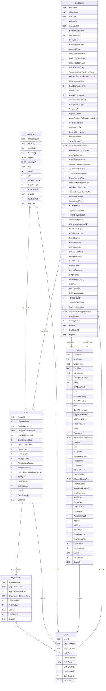

```mermaid
erDiagram
    User {
         S32 UserID
         S50 UserFirstName
         S50 UserLastName
         S10 UserPhone
         S5 UserExtension
         S320 UserEmail
         T DateCreated
         T DateUpdated
         T DateDeleted
         S32 ExportID
    }
    Project {
         S32 ProjectID
         S32 OrganizationID
         S200 ProjectName
         S200 ProjectCommonName
         D OperatingStartDate
         D OperatingEndDate
         I ContinuumProject
         I ProjectType
         I HousingType
         I RRHSubType
         I ResidentialAffiliation
         I TargetPopulation
         I HOPWAMedAssistedLivingFac
         I PITCount
         T DateCreated
         T DateUpdated
         S32 UserID
         T DateDeleted
         S32 ExportID
    }
    Client {
         S32 PersonalID
         S50 FirstName
         S50 MiddleName
         S50 LastName
         S50 NameSuffix
         I NameDataQuality
         S9 SSN[1]
         I SSNDataQuality
         D DOB
         I DOBDataQuality
         I AmIndAKNative
         I Asian
         I BlackAfAmerican
         I HispanicLatinaeo
         I MidEastNAfrican
         I NativeHIPacific
         I White
         I RaceNone
         S100 AdditionalRaceEthnicity
         I Woman
         I Man
         I NonBinary
         I CulturallySpecific
         I Transgender
         I Questioning
         I DifferentIdentity
         I GenderNone
         S100 DifferentIdentityText
         I VeteranStatus
         I YearEnteredService
         I YearSeparated
         I WorldWarII
         I KoreanWar
         I VietnamWar
         I DesertStorm
         I AfghanistanOEF
         I IraqOIF
         I IraqOND
         I OtherTheater
         I MilitaryBranch
         I DischargeStatus
         T DateCreated
         T DateUpdated
         S32 UserID
         T DateDeleted
         S32 ExportID
    }
    Organization {
         S32  OrganizationID
         S200  OrganizationName
         I  VictimServiceProvider
         S200  OrganizationCommonName
         T  DateCreated
         T  DateUpdated
         S32  UserID
         T  DateDeleted
         S32  ExportID
    }
    Enrollment {
         S32 EnrollmentID
         S32 PersonalID
         S32 ProjectID
         D EntryDate
         S32 HouseholdID
         I RelationshipToHoH
         S6 EnrollmentCoC
         I LivingSituation
         I RentalSubsidyType
         I LengthOfStay
         I LOSUnderThreshold
         I LOSUnderThreshold
         I PreviousStreetESSH
         D DateToStreetESSH
         I TimesHomelessPastThreeYears
         I MonthsHomelessPastThreeYears
         I DisablingCondition
         D DateOfEngagement
         D MoveInDate
         D DateOfPATHStatus
         I ClientEnrolledInPATH
         I ReasonNotEnrolled
         I PercentAMI
         I ReferralSource
         I CountOutreachReferralApproaches
         D DateOfBCPStatus
         I EligibleForRHY
         I ReasonNoServices
         I RunawayYouth
         I SexualOrientation
         S100 SexualOrientationOther
         I FormerWardChildWelfare
         I ChildWelfareYears
         I ChildWelfareMonths
         I FormerWardJuvenileJustice
         I JuvenileJusticeYears
         I JuvenileJusticeMonths
         I UnemploymentFam
         I MentalHealthDisorderFam
         I PhysicalDisabilityFam
         I AlcoholDrugUseDisorderFam
         I InsufficientIncome
         I IncarceratedParent
         S5 VAMCStation
         I TargetScreenReqd
         I TimeToHousingLoss
         I AnnualPercentAMI
         I LiteralHomelessHistory
         I ClientLeaseholder
         I HOHLeaseholder
         I SubsidyAtRisk
         I EvictionHistory
         I CriminalRecord
         I IncarceratedAdult
         I PrisonDischarge
         I SexOffender
         I DisabledHoH
         I CurrentPregnant
         I SingleParent
         I DependentUnder6
         I HH5Plus
         I CoCPrioritized
         I HPScreeningScore
         I ThresholdScore
         I TranslationNeeded
         I PreferredLanguage
         S100 PreferredLanguageDifferent
         T DateCreated
         T DateUpdated
         S32 UserID
         T DateDeleted
         S32 ExportID
    }
    ProjectCoC {
         S32 ProjectCoCID
         S32 ProjectID
         S6 CoCCode
         S6 Geocode[1]
         S100 Address1
         S100 Address2
         S50 City
         S2 State
         S5 ZIP
         I GeographyType
         T DateCreated
         T DateUpdated
         S32 UserID
         T DateDeleted
         S32 ExportID
    }
    Organization ||--|| User : UserID
    Project ||--|| Organization : OrganizationID
    Project ||--|| User : UserID
    ProjectCoC ||--|| Project : ProjectID
    ProjectCoC ||--|| User : UserID
    Client ||--|| User : UserID
    Enrollment ||--|| Client : PersonalID
    Enrollment ||--|| Project : ProjectID
    Enrollment ||--|| Client : HouseholdID
    Enrollment ||--|| User : UserID

```