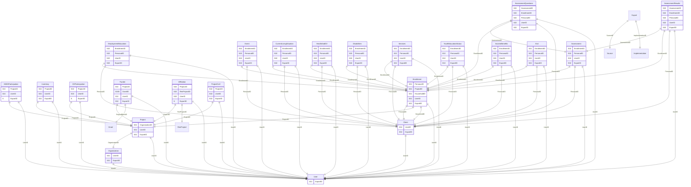

```mermaid
erDiagram
    User {
         S32 ExportID 
    }
    AssessmentResults {
         S32 AssessmentID 
         S32 EnrollmentID 
         S32 PersonalID 
         S32 UserID 
         S32 ExportID 
    }
    HMISParticipation {
         S32 ProjectID 
         S32 UserID 
         S ExportID 
    }
    EmploymentEducation {
         S32 EnrollmentID 
         S32 PersonalID 
         S32 UserID 
         S32 ExportID 
    }
    Inventory {
         S32 ProjectID 
         S32 UserID 
         S32 ExportID 
    }
    CEParticipation {
         S32 ProjectID 
         S32 UserID 
         S ExportID 
    }
    Event {
         S32 EnrollmentID 
         S32 PersonalID 
         S32 UserID 
         S32 ExportID 
    }
    CurrentLivingSituation {
         S32 EnrollmentID 
         S32 PersonalID 
         S32 UserID 
         S32 ExportID 
    }
    AssessmentQuestions {
         S32 AssessmentID 
         S32 EnrollmentID 
         S32 PersonalID 
         S32 UserID 
         S32 ExportID 
    }
    Organization {
         S32  UserID 
         S32  ExportID 
    }
    Enrollment {
         S32 PersonalID 
         S32 ProjectID 
         S32 HouseholdID 
         S32 UserID 
         S32 ExportID 
    }
    HealthAndDV {
         S32 EnrollmentID 
         S32 PersonalID 
         S32 UserID 
         S32 ExportID 
    }
    Disabilities {
         S32 EnrollmentID 
         S32 PersonalID 
         S32 UserID 
         S32 ExportID 
    }
    Services {
         S32 EnrollmentID 
         S32 PersonalID 
         S32 UserID 
         S32 ExportID 
    }
    Client {
         S32 UserID 
         S32 ExportID 
    }
    YouthEducationStatus {
         S32 EnrollmentID 
         S32 PersonalID 
         S32 UserID 
         S32 ExportID 
    }
    Assessment {
         S32 EnrollmentID 
         S32 PersonalID 
         S32 UserID 
         S32 ExportID 
    }
    Funder {
         S32 ProjectID 
         S100 GrantID 
         S32 UserID 
         S32 ExportID 
    }
    Project {
         S32 OrganizationID 
         S32 UserID 
         S32 ExportID 
    }
    Affiliation {
         S32 ProjectID 
         S32 ResProjectID 
         S32 UserID 
         S ExportID 
    }
    ProjectCoC {
         S32 ProjectID 
         S32 UserID 
         S32 ExportID 
    }
    IncomeBenefits {
         S32 EnrollmentID 
         S32 PersonalID 
         S32 UserID 
         S32 ExportID 
    }
    Exit {
         S32 EnrollmentID 
         S32 PersonalID 
         S32 UserID 
         S32 ExportID 
    }
    Export ||--|| Source : SourceID
    Export ||--|| Implementation : ImplementationID
    Organization ||--|| User : UserID
    Project ||--|| Organization : OrganizationID
    Project ||--|| User : UserID
    Funder ||--|| Project : ProjectID
    Funder ||--|| Grant : GrantID
    Funder ||--|| User : UserID
    ProjectCoC ||--|| Project : ProjectID
    ProjectCoC ||--|| User : UserID
    Inventory ||--|| Project : ProjectID
    Inventory ||--|| User : UserID
    Affiliation ||--|| Project : ProjectID
    Affiliation ||--|| ResProject : ResProjectID
    Affiliation ||--|| User : UserID
    HMISParticipation ||--|| Project : ProjectID
    HMISParticipation ||--|| User : UserID
    CEParticipation ||--|| Project : ProjectID
    CEParticipation ||--|| User : UserID
    Client ||--|| User : UserID
    Enrollment ||--|| Client : PersonalID
    Enrollment ||--|| Project : ProjectID
    Enrollment ||--|| Client : HouseholdID
    Enrollment ||--|| User : UserID
    Exit ||--|| Enrollment : EnrollmentID
    Exit ||--|| Client : PersonalID
    Exit ||--|| User : UserID
    IncomeBenefits ||--|| Enrollment : EnrollmentID
    IncomeBenefits ||--|| Client : PersonalID
    IncomeBenefits ||--|| User : UserID
    HealthAndDV ||--|| Enrollment : EnrollmentID
    HealthAndDV ||--|| Client : PersonalID
    HealthAndDV ||--|| User : UserID
    EmploymentEducation ||--|| Enrollment : EnrollmentID
    EmploymentEducation ||--|| Client : PersonalID
    EmploymentEducation ||--|| User : UserID
    Disabilities ||--|| Enrollment : EnrollmentID
    Disabilities ||--|| Client : PersonalID
    Disabilities ||--|| User : UserID
    Services ||--|| Enrollment : EnrollmentID
    Services ||--|| Client : PersonalID
    Services ||--|| User : UserID
    CurrentLivingSituation ||--|| Enrollment : EnrollmentID
    CurrentLivingSituation ||--|| Client : PersonalID
    CurrentLivingSituation ||--|| User : UserID
    Assessment ||--|| Enrollment : EnrollmentID
    Assessment ||--|| Client : PersonalID
    Assessment ||--|| User : UserID
    AssessmentQuestions ||--|| Assessment : AssessmentID
    AssessmentQuestions ||--|| Enrollment : EnrollmentID
    AssessmentQuestions ||--|| Client : PersonalID
    AssessmentQuestions ||--|| User : UserID
    AssessmentResults ||--|| Assessment : AssessmentID
    AssessmentResults ||--|| Enrollment : EnrollmentID
    AssessmentResults ||--|| Client : PersonalID
    AssessmentResults ||--|| User : UserID
    Event ||--|| Enrollment : EnrollmentID
    Event ||--|| Client : PersonalID
    Event ||--|| User : UserID
    YouthEducationStatus ||--|| Enrollment : EnrollmentID
    YouthEducationStatus ||--|| Client : PersonalID
    YouthEducationStatus ||--|| User : UserID

```