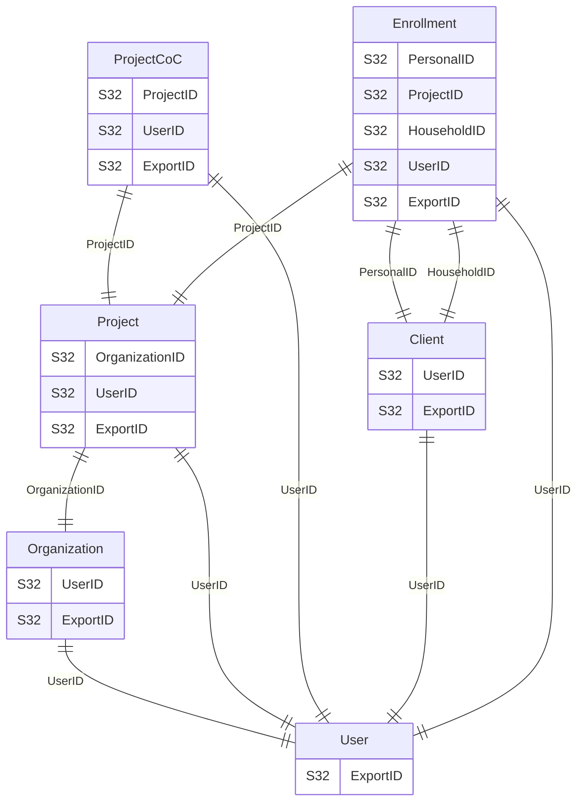

```mermaid
erDiagram
    User {
         S32 ExportID 
    }
    Project {
         S32 OrganizationID 
         S32 UserID 
         S32 ExportID 
    }
    Organization {
         S32  UserID 
         S32  ExportID 
    }
    ProjectCoC {
         S32 ProjectID 
         S32 UserID 
         S32 ExportID 
    }
    Client {
         S32 UserID 
         S32 ExportID 
    }
    Enrollment {
         S32 PersonalID 
         S32 ProjectID 
         S32 HouseholdID 
         S32 UserID 
         S32 ExportID 
    }
    Organization ||--|| User : UserID
    Project ||--|| Organization : OrganizationID
    Project ||--|| User : UserID
    ProjectCoC ||--|| Project : ProjectID
    ProjectCoC ||--|| User : UserID
    Client ||--|| User : UserID
    Enrollment ||--|| Client : PersonalID
    Enrollment ||--|| Project : ProjectID
    Enrollment ||--|| Client : HouseholdID
    Enrollment ||--|| User : UserID

```